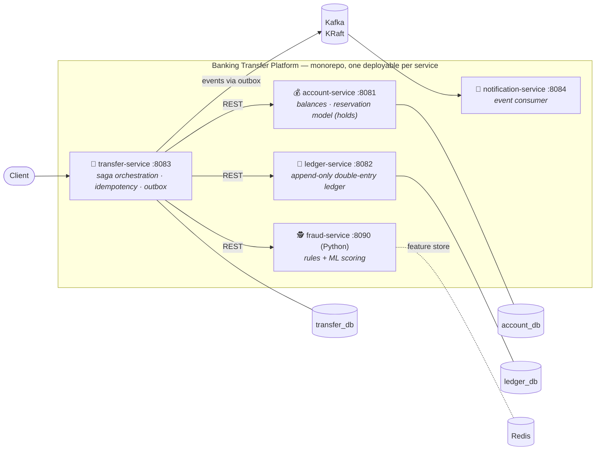
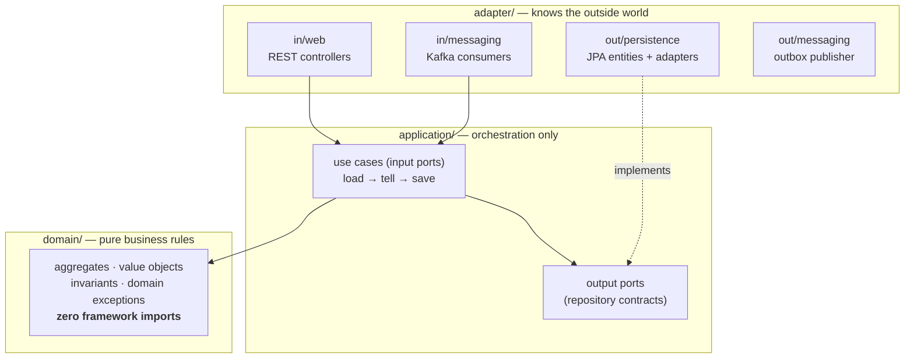

# 🏦 Banking Transfer Service

> A money transfer platform built as **microservices in a monorepo** — hexagonal
> architecture per service, DDD building blocks, an ML-powered fraud pipeline and a full
> MLOps lifecycle on AWS. Built step by step; every architectural choice is a written,
> argued decision.


---

## 🗺️ System architecture



### Inside every Java service — hexagonal, enforced by tests



The dependency rule (arrows point inward only) is not a convention — it is **executable**:
ArchUnit tests fail the build on any violation, per service.

## 📦 Modules & status

| Module | Port | Database | Responsibility | Status |
|---|---|---|---|---|
| `common` | — | — | Shared contracts: `Money`, typed IDs, event schemas | ✅ built, 94% cov |
| `account-service` | 8081 | `account_db` | Account lifecycle, balances, **hold/capture/release** reservation model | 🔨 domain ✅ · application ✅ · persistence ✅ · web ⏳ |
| `ledger-service` | 8082 | `ledger_db` | Append-only double-entry ledger, reconciliation | ⏳ skeleton |
| `transfer-service` | 8083 | `transfer_db` | Saga orchestration, idempotency keys, transactional outbox | ⏳ skeleton |
| `notification-service` | 8084 | — | Consumes transfer events, notifies customers | ⏳ skeleton |
| `fraud-service` | 8090 | — | Rule engine + ML scoring (Python/FastAPI, MLflow) | ⏳ planned |

## 📐 Architecture decisions (each one argued in `docs/adr/`)

| # | Decision | The gist |
|---|---|---|
| [0001](docs/adr/0001-microservices-monorepo.md) | **Microservices from day one, in a monorepo** | The goal is learning distributed-systems muscles: sagas, partial failure, eventual consistency. Database-per-service; `common` carries contracts only. |
| [0002](docs/adr/0002-ledger-source-of-truth.md) | **Ledger is the source of truth; balance is a projection** | Booked money history lives in the ledger; available balance lives in account-service via a reservation model (hold → capture/release). Reconciliation is mandatory, not optional. |
| 0003 *(pending)* | **AWS: ephemeral EKS on Free-Plan credits** | Terraform-managed cluster born and destroyed per session (~$2/session); stateful services run in-cluster (StatefulSet + EBS); NAT-free VPC; OIDC-federated CI. |
| 0004 *(upcoming)* | **Optimistic locking + bounded retry** | READ COMMITTED + `@Version`; conflict metrics decide if any hot flow ever earns pessimistic `FOR UPDATE`. |

## 🔬 Highlights so far

- **Money as a value object** — currency-scale invariants enforced at construction;
  algebraic laws (commutativity, inverse) verified by **property-based tests** (jqwik,
  1000 random samples per law).
- **Account aggregate** — no setters, single entry factory, entity equality by identity;
  the `balance − holds ≥ 0` invariant can never be observed broken.
- **Reservation model** — `hold / capture / release` with replay-safe semantics: a
  replayed hold signals *duplicate*, never *insufficient funds* — sagas depend on
  telling those apart.
- **Persistence without compromise** — JPA entities are separate from domain classes;
  holds map to an `@ElementCollection` so no independent hold repository can ever exist.
- **The lost-update demonstration** — an integration test races two real transactions
  over one account and catches the anomaly red-handed:
  `success=2 remaining=40.00 → 60.00 created out of thin air`. Fixed next by `@Version`.

## 🧪 Testing philosophy

```
        ▲  integration (Testcontainers, real PostgreSQL)   ~seconds
        │  — schema, mappings, transactions, races
        │  use-case tests (in-memory fake repository)      ~milliseconds
        │  — orchestration without Spring or a database
        ▼  domain tests (plain JUnit + jqwik properties)   ~microseconds
           — every business rule, exhaustively
```

No H2, no mocks-of-everything: fakes honor contracts, integration tests hit the real
dialect, and the domain needs no framework at all.

## 🚀 Getting started

```bash
docker compose up -d      # PostgreSQL (3 dbs), Redis, Kafka, Prometheus, Grafana
mvn verify                # build + all tests (unit, architecture, integration)
mvn -pl services/account-service spring-boot:run
```

Requires **JDK 25**, **Maven 3.9+**, **Docker**.

## 🧭 Roadmap

- [x] Monorepo skeleton, per-service ArchUnit guardrails, CI, JaCoCo
- [x] `common`: Money VO + typed identifiers (property-based tested)
- [x] Account domain: lifecycle + reservation model (hold/capture/release)
- [x] Application layer: ports, commands, orchestration service
- [x] Persistence: JPA adapter, Flyway, Testcontainers round-trip
- [x] Lost update demonstrated against real PostgreSQL
- [ ] Optimistic locking (`@Version`) + bounded retry ← *next*
- [ ] REST adapter + error contract (RFC 9457)
- [ ] Double-entry ledger service
- [ ] Transfer saga: orchestration, compensation, transactional outbox
- [ ] Fraud: rule engine → XGBoost + MLflow registry
- [ ] AWS: Terraform, ephemeral EKS, OIDC CI/CD
- [ ] MLOps: drift monitoring, shadow deployment

## 📚 Method

This repository doubles as a working study of *Domain-Driven Design* (Evans),
*Clean Architecture* & *Clean Code* (Martin) applied to a realistic banking domain —
concepts are introduced one atomic step at a time, every trade-off is discussed before
it is coded, and the failures (lost updates, race conditions) are demonstrated in tests
before their cures are applied.
