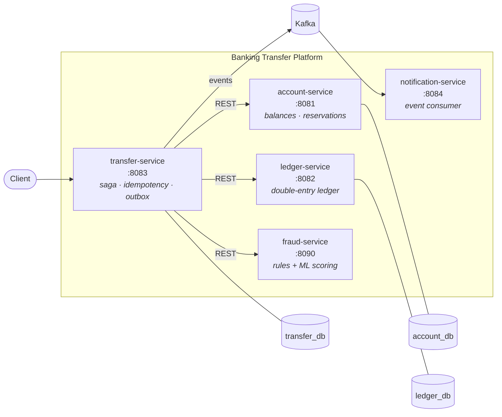

# 🏦 Banking Transfer Service

> A production-grade money transfer platform built as **microservices in a monorepo**, with
> **hexagonal architecture** per service, an ML-powered **fraud detection** pipeline and a
> full **MLOps** lifecycle — built step by step, decision by decision.


---

## 🗺️ Architecture



Every Java service follows the same **hexagonal (ports & adapters)** layout, enforced by
ArchUnit tests:

```
service/
└── com.bank.<context>/
    ├── domain/          # pure business rules — no framework allowed
    ├── application/     # use cases + ports (in/out)
    └── adapter/
        ├── in/web       # REST controllers
        ├── in/messaging # Kafka consumers
        ├── out/persistence
        └── out/messaging
```

## 📦 Services

| Service | Port | Database | Responsibility |
|---|---|---|---|
| **account-service** | 8081 | `account_db` | Account lifecycle, balances, reservations |
| **ledger-service** | 8082 | `ledger_db` | Append-only double-entry ledger, reconciliation |
| **transfer-service** | 8083 | `transfer_db` | Saga orchestration, idempotency, transactional outbox |
| **notification-service** | 8084 | — | Consumes transfer events, notifies customers |
| **fraud-service** *(Python)* | 8090 | — | Rule engine + ML scoring behind `/score` |
| **common** *(library)* | — | — | Shared contracts only: `Money`, IDs, event schemas |

## 📐 Design principles

- **Database-per-service** — no service ever touches another service's database.
- **Ledger is the source of truth** for booked money movements; account balance is a
  derived projection. Available balance lives in account-service via a reservation model.
  See [ADR-0002](docs/adr/0002-ledger-source-of-truth.md).
- **Contracts over shared code** — `common` carries value objects and event schemas only;
  business logic in a shared library is forbidden coupling.
- **Screaming architecture** — packages are named after domain concepts (`money`,
  `identity`, `event`), never after technical patterns.
- **Architecture as tests** — dependency rules are executable (ArchUnit) and fail the build
  when violated.

All decisions are recorded as ADRs in [`docs/adr/`](docs/adr/).

## 🚀 Getting started

```bash
# infrastructure: PostgreSQL (3 dbs), Redis, Kafka, Prometheus, Grafana
docker compose up -d

# build everything & run all tests
mvn verify

# run a service (each one is a separate process)
mvn -pl services/account-service spring-boot:run
```

Requires **JDK 25**, **Maven 3.9+** and **Docker**.

## 🧭 Roadmap

- [x] Monorepo skeleton — 4 Spring Boot services + shared contracts library
- [x] Architecture guardrails (ArchUnit hexagonal rules per service)
- [ ] `Money` value object & property-based tests *(in progress)*
- [ ] Account domain: open/close, deposits, reservation model
- [ ] Double-entry ledger with balance reconciliation
- [ ] Transfer saga: orchestration, compensation, idempotency keys
- [ ] Transactional outbox → Kafka events
- [ ] Fraud service: rule engine, then ML model (XGBoost + MLflow)
- [ ] MLOps: experiment tracking, model registry, drift monitoring
- [ ] Kubernetes deployment, observability dashboards, load testing

## 📚 Learning log

This repository doubles as a study of *Domain-Driven Design* (Evans), *Clean Code* and
*Clean Architecture* (Martin) applied to a realistic banking domain — each commit maps to
a concept, each architectural choice to a written decision record.
